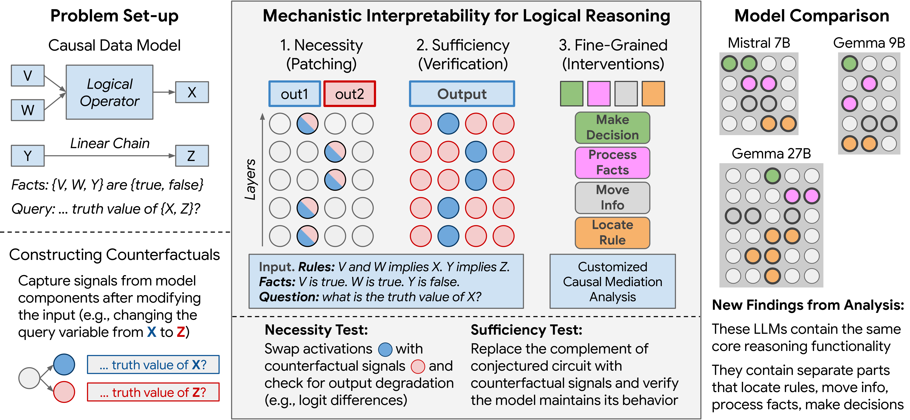
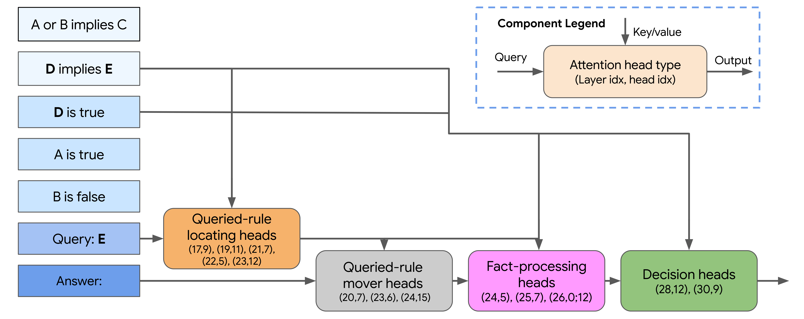
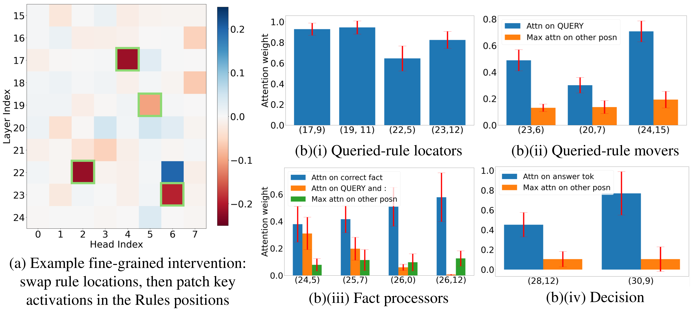

# A Implies B: Circuit Analysis in LLMs for Propositional Logical Reasoning

## Introduction

This repository contains a walkthrough of the main experiments in the NeurIPS 2025 paper [A Implies B: Circuit Analysis in LLMs for Propositional Logical Reasoning](https://arxiv.org/pdf/2411.04105). 

*About this work*. We wish to make progress in understanding the latent reasoning capabilities of LLMs. We use tools from mechanistic interpretability to do this. In particular, we perform *causal mediation analysis* on how LLMs (Gemma-2-9B, Gemma-2-27B and Mistral-7B-v0.1) write minimal *propositional logic* proofs that requires combining rules and facts. The problems have the following form:

Rules: $A$ or $B$ implies $C$. $D$ implies $E$. Facts: $A$ is true. $B$ is false. $D$ is true. Question: what is the truth value of $C$? Minimal Proof: $A$ is true. $A$ or $B$ implies $C$; $C$ is true.

We show the LLMs a few examples of such problem-proof pairs, and ask them to write the proof for a new one. We summarize the overall analysis procedure in the figure below.



With careful necessity and sufficiency tests conducted (measuring indirect and direct effects of candidate mediators appropriately), we surfaced "circuits" in the LLMs for latently resolving important parts of the proof to write down. For example, the figure below shows the attention-head circuit adopted by Gemma-2-9B for resolving the first answer token in the proof, which needs to invoke the right fact to start the proof (requiring to latently execute "QUERY $\to$ Relevant Rule $\to$ Relevant Fact $\to$ Correct Answer Token", essentially the hardest place in the proof). We index attention heads by (Layer Index, Head Index).



The attention head families are primarily divided according to their attention patterns and finer "causal surgeries", such as swapping the locations of the rules while keeping everything else identical across the normal-counterfactual pairs of prompts. We illustrate select results for the Gemma-2-9B model in the figure below.



The surprising part is that the LLMs we analyzed all seem to share the functional sub-circuits, that is, they contain families of attention heads which exhibit specialized attention patterns as seen in the 9B model, and respond similarly to the "causal surgeries". However, certain differences still exists across scale: the 27B model's circuits have a greater degree of parallelism in it, e.g., some of its fact-processing heads have direct effects on the logits, while the 9B model's do not. On the other hand, for the circuit we surfaced in a small 3-layer model trained from scratch on a slightly more complex version of the logic problems, we observed weaker human-interpretability, and the model relies on heuristics instead of consistent mechanisms for latently resolving parts of the proof. Please refer to our paper for full details.

In addition, while the full analysis in our paper was conducted inside Google, the open-sourced code in this repository is built on the [TransformerLens library](https://github.com/TransformerLensOrg/TransformerLens).

## Getting Started

In this repository, we present a series of Jupyter notebooks that walks through the main experiments in our paper. We hope that the more interactive and "tutorial-like" way of presenting the analysis helps convey deeper insights than only reading the paper. The notebooks are contained in the folder `analysis_walkthrough`.

To get started, you will need to install the required packages for the TransformerLens library. However, in the Jupyter notebooks, we also provide a section for environment setup for your convenience. Moreover, you will need a Huggingface account for downloading the Gemma 2 models which we will conduct analyses on. Additionally, the folder `helpers` contain the patching and attention analysis tools which we use in the notebooks for analyzing the LLMs.

For shared GPU-server deployment with Docker and Jupyter, see `SERVER_DOCKER_RUNBOOK.md`.

## BibTeX
```
@inproceedings{
hong2025a,
title={A Implies B: Circuit Analysis in {LLM}s for Propositional Logical Reasoning},
author={Guan Zhe Hong and Nishanth Dikkala and Enming Luo and Cyrus Rashtchian and Xin Wang and Rina Panigrahy},
booktitle={The Thirty-ninth Annual Conference on Neural Information Processing Systems},
year={2025},
url={https://openreview.net/forum?id=M0U8wUow8c}
}
```
